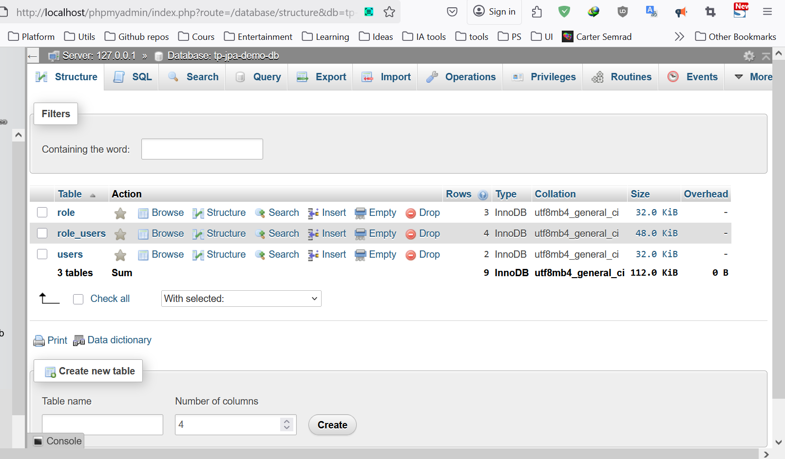
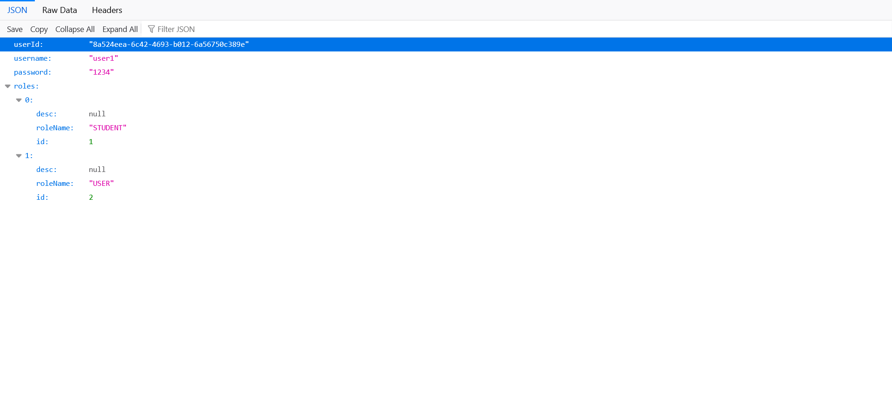
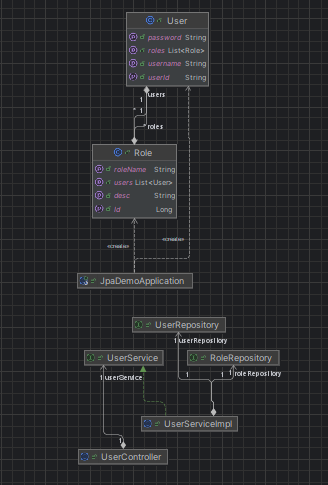

# Projet de Démonstration JPA

## 1. Aperçu

Ce projet est une application de démonstration Spring Boot illustrant l'utilisation de Spring Data JPA pour les interactions avec la base de données. Il présente un système de gestion basique des Utilisateurs (User) et des Rôles (Role), incluant l'initialisation des données et un mécanisme d'authentification simple. L'application est configurée pour fonctionner avec une base de données MySQL.

## 2. Technologies Utilisées

*   **Java :** Version 21
*   **Spring Boot :** Version 3.4.3
    *   Spring Data JPA : Pour la persistance et l'ORM.
    *   Spring Web : Pour des fonctionnalités web potentielles (bien que l'accent soit actuellement mis sur le noyau JPA).
*   **Maven :** Pour la construction du projet et la gestion des dépendances.
*   **MySQL :** Base de données relationnelle.
*   **Lombok :** Pour réduire le code répétitif (par exemple, getters, setters, constructeurs).

## 3. Prérequis

Avant d'exécuter cette application, assurez-vous d'avoir installé les éléments suivants :

*   Java Development Kit (JDK) 21 ou ultérieur.
*   Apache Maven.
*   Serveur MySQL (fonctionnant sur `localhost:3306`).

## 4. Installation et Configuration

1.  **Clôner le dépôt (si applicable) :**
    ```bash
    git clone <url-de-votre-depot>
    cd jpa-demo
    ```

2.  **Configuration de la base de données :**
    *   Assurez-vous que votre serveur MySQL est en cours d'exécution.
    *   L'application est configurée pour se connecter à une base de données nommée `tp-jpa-demo-db` avec l'utilisateur `root` et sans mot de passe. Elle tentera de créer cette base de données si elle n'existe pas (`createDatabaseIfNotExist=true` dans `application.properties`).
    *   La propriété `spring.jpa.hibernate.ddl-auto=create` dans `application.properties` signifie que le schéma de la base de données (tables) sera automatiquement créé (ou recréé) au démarrage de l'application. **Attention :** Cela supprimera les données existantes dans les tables à chaque fois.

    *Paramètres pertinents d'application.properties :*
    ```properties
    spring.datasource.url=jdbc:mysql://localhost:3306/tp-jpa-demo-db?createDatabaseIfNotExist=true
    spring.datasource.username=root
    spring.datasource.password=
    spring.jpa.hibernate.ddl-auto=create
    server.port=8083
    ```

3.  **Construire le projet :**
    ```bash
    mvn clean install
    ```

## 5. Comment Exécuter l'Application

Une fois le projet construit, vous pouvez exécuter l'application Spring Boot en utilisant Maven :

```bash
mvn spring-boot:run
```

Alternativement, vous pouvez exécuter le fichier JAR packagé (après `mvn clean install`) :

```bash
java -jar target/jpa-demo-0.0.1-SNAPSHOT.jar
```

L'application démarrera, et vous devriez voir des journaux dans la console, y compris l'initialisation des utilisateurs et des rôles, ainsi qu'une tentative d'authentification pour `user1`. Le serveur fonctionnera sur `http://localhost:8083`.

## 6. Fonctionnalités Clés

*   **Entités User et Role :** Définit les entités `User` et `Role` avec une relation Many-to-Many.
    *   `User` : (userId, username, password)
    *   `Role` : (Id, desc, roleName)
*   **Initialisation des Données :** Au démarrage de l'application, des exemples d'utilisateurs (`user1`, `admin`) et de rôles (`STUDENT`, `USER`, `ADMIN`) sont créés et assignés.
*   **Exemple d'Authentification Basique :** La classe `JpaDemoApplication` inclut un `CommandLineRunner` qui démontre une authentification utilisateur basique (`userService.authenticate("user1","1234")`).
*   **Sortie Console :** L'application journalise les requêtes SQL et les résultats de la configuration initiale des données et du test d'authentification dans la console.

## 7. Structure du Projet

Un bref aperçu des principaux packages :

*   `src/main/java/ma/abdellah/jpademo`
    *   `JpaDemoApplication.java` : Classe principale de l'application Spring Boot, inclut `CommandLineRunner` pour l'initialisation des données.
    *   `entities/` : Contient les classes d'entités JPA (`User.java`, `Role.java`).
    *   `repositories/` : Contient les interfaces de repository Spring Data JPA (par exemple, `UserRepository.java`, `RoleRepository.java`).
    *   `service/` : Contient les interfaces et implémentations de la couche service (par exemple, `UserService.java`, `UserServiceImpl.java`).
    *   `web/` : Destiné aux contrôleurs Spring MVC (par exemple, `UserController.java`).
*   `src/main/resources/`
    *   `application.properties` : Contient la configuration de l'application, y compris les détails de connexion à la base de données.

## 8. Captures d'Écran

*(Veuillez ajouter vos captures d'écran ici. Vous pouvez décrire ce que chaque capture d'écran démontre.)*

### Exemple : Structure de la base de données après le démarrage de l'application



### Exemple : en test l'endpoint rest



### Exemple : Diagramme de classes



---
